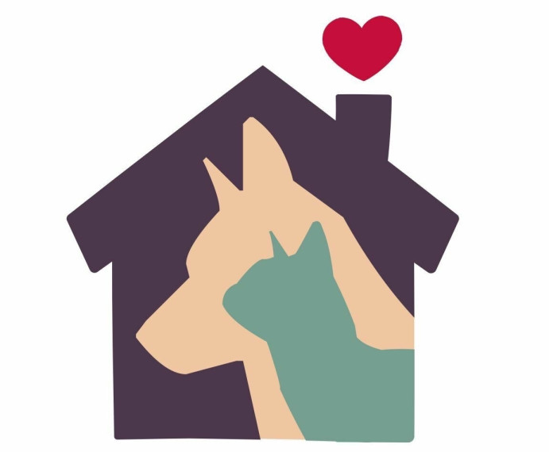
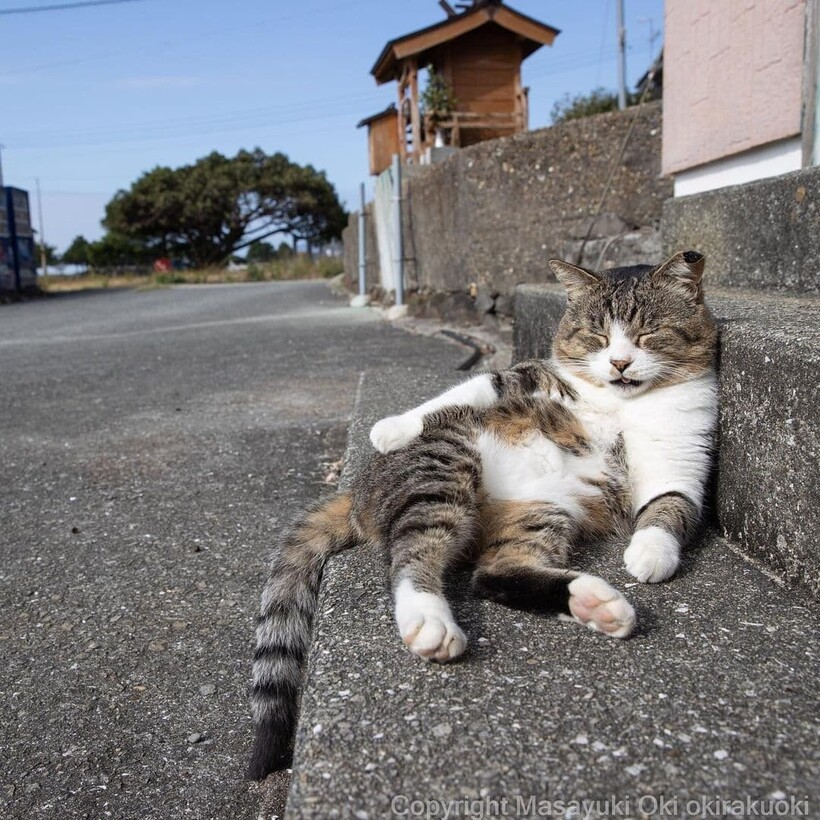
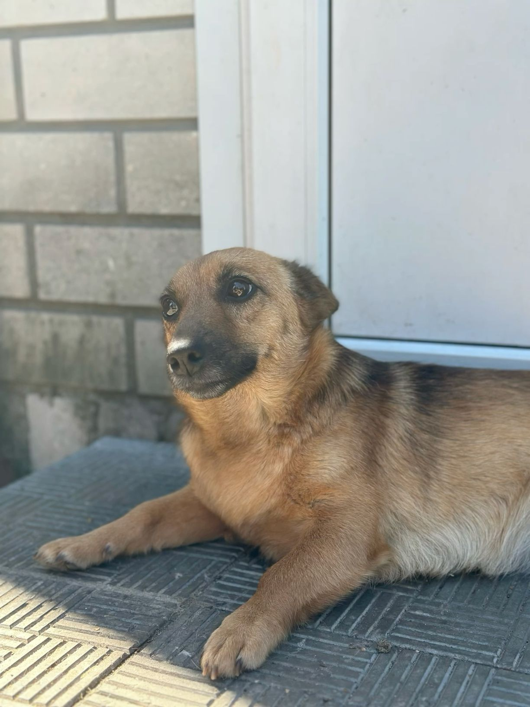
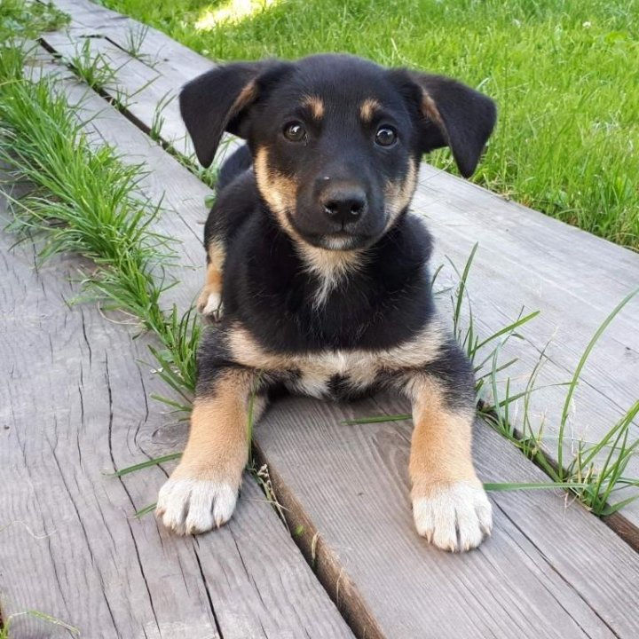

[index.html](https://github.com/user-attachments/files/32850793/index.html)
   <!DOCTYPE html>
<html lang="ru">
<head>
    <meta charset="UTF-8">
    <meta name="viewport" content="width=device-width, initial-scale=1.0">
    <title>Приют для животных AnimalHome</title>
    
    <link href="https://cdn.jsdelivr.net/npm/bootstrap@5.3.0/dist/css/bootstrap.min.css" rel="stylesheet">
    
    <link rel="stylesheet" type="text/css" href="css/style.css">
</head>
<body>
<header>
    <nav class="navbar navbar-expand-lg bg-light navbar-light shadow-sm">
        

            <a class="navbar-brand fw-bold text-success" href="#">AnimalHome</a>
            <button class="navbar-toggler" type="button" data-bs-toggle="collapse" data-bs-target="#navbarNav">
                
            </button>
            

                <ul class="navbar-nav me-auto mb-2 mb-lg-0">
                    <li class="nav-item"><a class="nav-link" href="#">Взять собаку</a></li>
                    <li class="nav-item"><a class="nav-link" href="#">Взять кошку</a></li>
                    <li class="nav-item"><a class="nav-link" href="#">О нас</a></li>
                    <li class="nav-item"><a class="nav-link" href="#">Пожертвовать</a></li>
                    <li class="nav-item"><a class="nav-link" href="#">Контакты</a></li>
                </ul>
                <form class="d-flex">
                    <input class="form-control me-2" type="search" placeholder="Найти животное">
                    <button class="btn btn-outline-success" type="submit">Найти</button>
                </form>
            

        

    </nav>
</header>
<section class="welcome-section py-5">
    

        

            

                <h1 class="fw-bold mb-3">Добро пожаловать в AnimalHome</h1>
                

                    Мы помогаем бездомным животным найти любящую семью. Каждая собака и кошка заслуживает тёплый дом, полную миску корма и заботливого хозяина. Пролистайте наши карточки и выберите себе верного друга!
                

            

            

                
            

        

    

</section>
<section class="cards-section py-5 bg-light">
    

        <h2 class="text-center fw-bold mb-5">Наши питомцы</h2>
        
        

            

                

                    
 
                    

                        <h5 class="card-title fw-bold">Барсик</h5>
                        
Ласковый, добрый кот.
Возраст — 3 года.

                        <a href="#" class="btn btn-primary px-4">Взять кота</a>
                    

                

            

            

                

                    
 
                    

                        <h5 class="card-title fw-bold">Рекс</h5>
                        
Активный, верный защитник.
Возраст — 2 года.

                        <a href="#" class="btn btn-success px-4">Взять собаку</a>
                    

                

            

            

                

   
 
                    

                        <h5 class="card-title fw-bold">Барбос</h5>
                        
Игривый, любит детей.
Возраст — 5 месяцев.

                        <a href="#" class="btn btn-success px-4">Взять щенка</a>
                    

                

            

        

    

</section>
    
</body>
</html>
